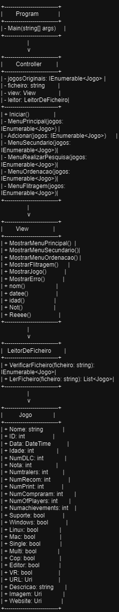

# Gerenciamento de Jogos em C#

Este projeto de gerenciamento de jogos em C# inclui as seguintes classes:

- **Program**: Inicia a aplicação.
- **Controller**: Gerencia a lógica do sistema.
- **View**: Exibe menus e resultados para o usuário.
- **LeitorDeFicheiro**: Lê dados de um arquivo CSV.
- **Jogo**: Representa os dados de cada jogo.

## Funcionalidades Principais

- **Leitura de Dados**: O sistema é capaz de ler dados de um arquivo CSV para carregar informações dos jogos.
- **Interface Interativa**: Uma interface interativa permite que o usuário navegue pelo sistema, realizando diferentes operações.
- **Filtragem e Ordenação**: Os jogos podem ser filtrados e ordenados por critérios variados, como nome, data de lançamento, nota no Metacritic, entre outros.
- **Exibição Detalhada**: O sistema exibe informações detalhadas de cada jogo, incluindo nome, data de lançamento, número de DLCs, nota no Metacritic, número de recomendações, número de cópias compradas, número de jogadores ativos e número de conquistas.

O projeto demonstra o uso de Programação Orientada a Objetos para criar um sistema modular e extensível.

